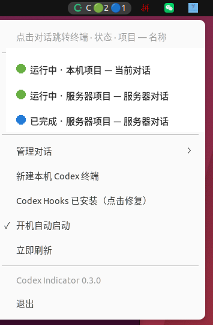

# CC Indicator

[中文](README.md) · [English](README.en.md)

一个轻量的系统托盘工具，用来一眼查看多个 Codex CLI / Claude Code CLI 终端。



## 你能看到什么

- 每个终端的状态：运行中、等待操作、已完成
- 项目名称旁标注 [Codex] 或 [Claude]，以及简短的对话名称
- 本机终端，以及 Ubuntu 上已连接 SSH 服务器的 Codex / Claude 终端
- 点击会话直接跳转到对应终端
- 修改对话名称、归档对话、新建 Codex / Claude 终端
- 状态栏按状态显示颜色和数量

它不复制完整聊天记录，不创建工作树，不需要 tmux、Docker、Electron 或云服务。所有数据留在本机。

## 平台

- Ubuntu 22.04+：原生顶栏 AppIndicator，并支持 SSH 终端发现
- Windows：通知区域托盘
- macOS：菜单栏

## 安装

从 [Releases](https://github.com/Heimao-c/cc-indicator/releases) 下载对应平台的发布包。

Ubuntu 也可以进行用户级安装：

```bash
git clone https://github.com/Heimao-c/cc-indicator.git
cd cc-indicator
sh scripts/install-linux.sh
```

Ubuntu 22.04 需要：

```bash
sudo apt install python3-gi gir1.2-gtk-3.0 \
  gir1.2-ayatanaappindicator3-0.1 gir1.2-atspi-2.0 \
  libayatana-appindicator3-1 libx11-6 libxtst6 x11-utils
```

Windows 解压发布包后运行 `CCIndicator/CCIndicator.exe`。macOS 解压后将 `.app` 和 `CCIndicatorHook` 放在同一目录，再启动 `.app`。

首次运行后，从托盘菜单安装 Codex + Claude Hooks：Codex 的 Hook 写入 `~/.codex/hooks.json`，Claude Code 的 Hook 写入 `~/.claude/settings.json`（保留你已有的配置，Claude Code 会自动热加载）。在 Codex CLI 中打开 `/hooks`，确认并信任指向本机的 Hook；未信任时，工具只能显示被动扫描到的部分状态。

## Claude Code 支持

- Claude Code 的终端对话与 Codex 合并显示在同一个托盘菜单中，状态含义完全一致
- 等待权限批准时同样显示 `◐ 等待操作`：通过 `Notification` 事件感知，只读取、不拦截也不拒绝任何请求
- Claude Code 没有管理接口，因此重命名只作用于指示器显示（本地保存，不影响 Claude 自身），归档为本地隐藏（不影响 Claude 自身的会话）
- 托盘提供「Claude 自动允许全部操作」开关：写入 Claude Code 的 `permissions.defaultMode=bypassPermissions`，本机以及所有已连接 SSH 主机上带 Claude 配置的都会写入；所有新请求自动放行，你已有的危险命令拒绝规则仍然生效；关闭即恢复逐个询问。注意：已在运行的 Claude 会话保持启动时的许可模式，需要重启会话（或 `/clear`）后开关才会生效
- 需要 Claude Code 2.x；对话标题取自助记文件（`~/.claude/projects/`）中的首个用户消息

## 状态如何判断

| 状态 | 含义 |
| --- | --- |
| `● 运行中` | 正在处理提示、调用工具、压缩上下文或运行子代理 |
| `◐ 等待操作` | 等待权限批准或等待 `request_user_input` 的回答 |
| `✓ 已完成` | 当前一轮任务已结束，终端仍可继续使用 |

旧版本缓存中的 `空闲` 状态会自动迁移为 `已完成`。

## 隐私与权限

CC Indicator 不连接自己的服务器，不上传项目文件、提示词、回复、API Key 或 Codex 凭据。缓存只保存会话 ID、状态、目录、时间、进程/终端标识以及必要的标题和项目摘要。

Ubuntu 的批量允许功能会读取当前终端画面，只在确认是 Codex 的批准界面时发送一次确认键；普通审批直接处理，整盘清除、系统目录递归删除等高危操作仍会单独询问。画面不会保存。

SSH 识别使用本机已有的 SSH 进程和只读探测，不保存私钥或密码。远端 Claude 会话通过其 transcript 目录发现，状态由 transcript 的最近写入时间推断。新版远端 Codex 如果没有可读取的 rollout 文件，会按 SSH TTY 显示终端占位信息（状态由远端 app-server 数据库推断）；占位终端仍可重命名/归档，效果为本地的显示改名/隐藏。远端批准界面无法从本机屏幕读取，因此远端会话等待批准时显示为「运行中」而非「等待操作」。

## 命令行与开发

```bash
cc-indicator --install-hooks
cc-indicator --install-autostart
cc-indicator --dump-status
cc-indicator --doctor
```

运行测试：

```bash
PYTHONPATH=src python3 -m unittest discover -s tests -v
```

GitHub Actions 会在 Ubuntu、Windows 和 macOS 上运行测试；推送 `v*` 标签时生成三平台发布包。当前发布包未签名，Windows SmartScreen 和 macOS Gatekeeper 可能需要首次手动确认。

## 已知限制

- 实时状态依赖 Codex Hooks 信任；已经运行的 Codex 可能需要重新打开 `/hooks`。
- 终端跳转目前针对 Ubuntu GNOME Terminal、Windows Terminal 和 macOS Terminal。
- SSH 自动发现和批量审批只在 Ubuntu 提供。

## 许可证

[MIT](LICENSE)
